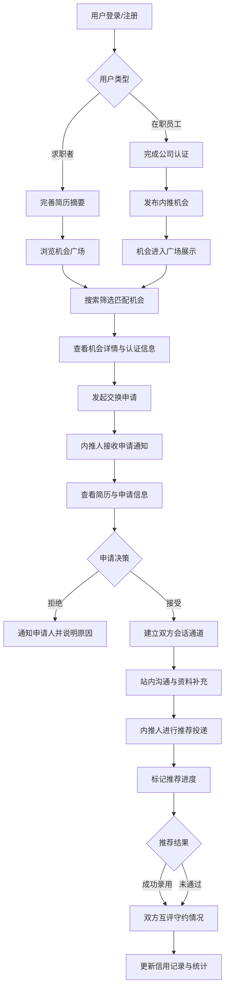

## 1. 产品概述

内推交换平台是一个面向求职者与在职员工的双向匹配 Web 应用，解决传统内推渠道信息不对称、信任缺失和效率低下的痛点。通过安全的身份认证、标准化的交换流程和信用评价体系，为用户提供可信赖的内推机会发布、智能匹配和全流程管理服务。

- 核心用户：正在寻找内推机会的求职者、希望进行内推资源交换的在职员工
- 产品价值：建立安全透明的内推生态，降低求职与招聘成本，提升人才匹配效率

---

## 2. 核心功能

### 2.1 用户角色

| 角色 | 注册方式 | 核心权限 |
|------|----------|----------|
| 求职者 | 邮箱/手机号注册 | 浏览内推机会、搜索匹配、发起交换申请、上传简历、消息沟通、标记结果、评价互评 |
| 在职员工 | 邮箱/手机号 + 公司认证 | 发布内推岗位、设置交换条件、处理申请、推荐候选人、查看信用记录 |

### 2.2 功能模块

1. **首页**：导航栏、用户头像入口、待处理事项卡片、成功推荐数据统计看板、快捷操作入口
2. **机会广场**：搜索筛选栏（岗位/城市/行业/薪资）、内推机会卡片列表、发布机会按钮、机会详情弹窗
3. **个人主页**：个人信息展示、认证信息、隐私设置、已发布机会、收藏夹、简历管理
4. **交换申请**：发起的申请列表、收到的申请列表、申请详情、处理操作（接受/拒绝/标记进度）
5. **消息中心**：会话列表、消息对话区、消息类型标识、快捷回复、标记已读
6. **信用记录**：守约评分、评价列表、成功案例、举报记录入口

### 2.3 页面详情

| 页面名称 | 模块名称 | 功能描述 |
|----------|----------|----------|
| 首页 | 顶部导航栏 | 品牌 Logo、页面切换导航、搜索框、通知铃铛、用户头像下拉菜单 |
| 首页 | 待办事项区 | 卡片式展示：待回复申请、未读消息、待上传简历、待评价等，点击直接跳转 |
| 首页 | 数据统计区 | 成功推荐数、当前进行中申请、守约评分、本月新增机会的可视化看板 |
| 首页 | 快捷操作区 | 发布机会、搜索机会、查看消息、管理简历的快捷入口按钮 |
| 机会广场 | 搜索筛选栏 | 关键词搜索、城市筛选、行业筛选、薪资范围、发布时间、排序方式 |
| 机会广场 | 机会卡片网格 | 公司 Logo、岗位名称、城市、薪资范围、内推人信息、期望交换条件、匹配度标签 |
| 机会广场 | 发布机会弹窗 | 公司信息、岗位信息、内推说明、期望交换条件表单、隐私可见范围设置 |
| 机会广场 | 机会详情侧栏 | 完整岗位描述、内推人认证信息、申请按钮、收藏按钮、举报入口 |
| 个人主页 | 个人资料卡 | 头像、昵称、身份标签、简介、联系方式（按隐私设置展示） |
| 个人主页 | 认证信息区 | 身份认证状态、公司认证徽章、学历认证、验证时间 |
| 个人主页 | Tab 内容区 | 已发布机会、收藏的机会、我的简历、隐私设置 |
| 个人主页 | 简历管理 | 简历摘要上传/编辑、技能标签、工作经历摘要、可见范围设置 |
| 交换申请 | 双栏切换 | 我发起的 / 我收到的 申请列表切换 |
| 交换申请 | 申请卡片 | 机会标题、对方信息、申请状态、申请时间、快捷操作按钮 |
| 交换申请 | 申请详情弹窗 | 简历摘要预览、消息记录、进度时间线、处理操作面板 |
| 消息中心 | 会话列表 | 会话缩略卡、最新消息预览、未读标识、在线状态、时间戳 |
| 消息中心 | 对话区 | 消息气泡、时间分割线、文件/简历附件、快捷操作菜单 |
| 消息中心 | 输入区 | 文本输入框、表情按钮、附件上传、发送按钮 |
| 信用记录 | 评分概览 | 综合守约评分、维度雷达图（响应速度/守约率/沟通态度/推荐质量） |
| 信用记录 | 评价列表 | 对方头像、评价内容、评分星级、评价时间、关联机会 |
| 信用记录 | 成功案例 | 时间线展示成功推荐记录，含公司、岗位、时间 |
| 信用记录 | 举报入口 | 异常行为举报表单、证据上传、类型选择 |

---

## 3. 核心流程

### 3.1 主流程描述

**发布内推机会流程**：在职员工登录 → 点击"发布机会" → 填写公司/岗位/内推说明 → 设置期望交换条件（希望获得哪类内推）→ 选择隐私可见范围 → 提交发布 → 机会进入广场展示

**申请交换流程**：求职者浏览广场 → 搜索筛选目标岗位 → 查看机会详情和内推人认证 → 点击"发起申请" → 选择/上传简历摘要 → 填写附加说明 → 提交 → 申请发送给内推人

**申请处理流程**：内推人收到申请通知 → 查看申请详情与简历 → 接受/拒绝申请 → 接受后进入沟通阶段 → 内推人进行推荐 → 标记推荐进度（已投递/面试中/已录用/未通过）→ 双方互评 → 流程结束

### 3.2 Mermaid 流程图

---

## 4. 用户界面设计

### 4.1 设计风格

**设计定位：专业可信的人才匹配平台，现代商务风格**

- **主色调**：深海蓝 `#1e3a5f`（专业、信任），搭配 青碧蓝 `#0ea5e9` 作为点缀色（活力、连接）
- **辅助色**：翠绿 `#10b981`（成功/通过），琥珀橙 `#f59e0b`（警示/待处理），玫红 `#ef4444`（拒绝/错误）
- **背景色**：米白灰 `#f8fafc`（主背景），纯白 `#ffffff`（卡片），浅蓝灰 `#e2e8f0`（分隔线）
- **字体方案**：标题使用 **"Noto Serif SC"** 衬线字体（专业权威感），正文使用 **"Inter"** 无衬线字体（现代易读）
- **按钮风格**：中等圆角 `8px`，主按钮为深海蓝渐变填充配白字，次级按钮为描边样式，悬停有轻微上浮与阴影加深
- **卡片风格**：白色圆角 `12px`，柔和阴影 `0 4px 20px rgba(30,58,95,0.08)`，悬停阴影增强并轻微位移
- **布局风格**：顶部固定导航栏 + 左侧页面内次级导航（按需）+ 主体内容区采用 24 栅格系统，卡片网格布局
- **图标风格**：使用 **Lucide React** 线性图标，尺寸统一 20px，颜色与文字层级对应
- **动效风格**：页面切换使用淡入 + 轻微上移动画，卡片悬停有 4px 上浮，按钮点击有 0.95 缩放反馈，数据统计数字有滚动递增动画

### 4.2 页面设计概述

| 页面名称 | 模块名称 | UI 元素 |
|----------|----------|----------|
| 首页 | 顶部导航栏 | 深蓝背景渐变，白色文字，当前页有青碧蓝下划线指示，通知铃铛带红色圆点徽标 |
| 首页 | 数据统计看板 | 4 个并排统计卡片，每个含图标+数值+环比变化箭头，底部有迷你趋势折线图 |
| 首页 | 待办事项列表 | 左侧彩色竖条标识待办类型（琥珀/青/玫红），标题+时间+跳转按钮 |
| 首页 | 快捷操作区 | 2×2 卡片网格，渐变图标背景 + 文字描述，悬停时图标旋转微动画 |
| 机会广场 | 搜索筛选栏 | 白色长条搜索框配搜索图标，筛选标签采用 chip 样式，可删除已选条件 |
| 机会广场 | 机会卡片 | 左侧公司 Logo 圆形容器，中间岗位信息，右侧匹配度标签与操作区，底部期望条件 chip |
| 机会广场 | 发布机会弹窗 | 半透明遮罩，居中白色大卡片，分步骤表单指示器，输入框带浮动标签 |
| 个人主页 | 个人资料卡 | 顶部渐变横幅覆盖，左下角圆形头像（外圈发光描边），身份认证徽章角标 |
| 个人主页 | Tab 导航 | 下划线式 Tab，当前项青碧蓝粗线，过渡动画平滑 |
| 交换申请 | 申请卡片 | 时间轴式左侧进度条，状态颜色区分，右侧展开/收起详情按钮 |
| 消息中心 | 会话列表 | 左栏固定宽度，未读会话加粗并带蓝色未读圆点，选中项高亮背景 |
| 消息中心 | 对话气泡 | 我方消息靠右浅蓝背景，对方消息靠左白框深色字，时间戳灰色小字居中 |
| 信用记录 | 评分概览 | 大号评分数字居中，环形进度条外圈，下方五维雷达图 |
| 信用记录 | 评价列表 | 头像+星级+文字，可展开查看详情，顶部筛选 Tab |

### 4.3 响应式设计

- **设计基准**：桌面端优先（1440px），向下适配平板（768px）和移动端（375px）
- **栅格系统**：桌面端 24 列，平板端 12 列，移动端 6 列，间距统一使用 8 的倍数
- **导航栏适配**：移动端顶部导航收起为汉堡菜单，页面内次级导航改为水平滚动 Tab
- **卡片布局**：桌面端 3-4 列网格，平板端 2 列，移动端 1 列单列瀑布流
- **弹窗适配**：桌面端居中浮窗，移动端改为底部抽屉式面板，从下往上滑出
- **交互优化**：移动端增大点击热区至 44×44px，关键按钮移至拇指可达区域
- **表单适配**：桌面端双列表单，移动端改为单列堆叠，长输入框改为分段选择器

### 4.4 视觉增强细节

- **全局背景**：浅灰蓝底色叠加极淡的点阵纹理（SVG noise），避免纯色单调
- **卡片装饰**：关键统计卡片右上角添加渐变装饰色块（几何形状，10% 透明度）
- **分隔手法**：模块间使用细线 + 充足留白而非硬边框，保持呼吸感
- **加载状态**：骨架屏（Skeleton）使用浅灰渐变 + 从左到右的微光扫过动画
- **空状态**：手绘风格插图 + 引导文字 + 行动按钮，减少空白感
- **滚动条**：自定义细滚动条，轨道透明，滑块浅灰蓝悬停加深
