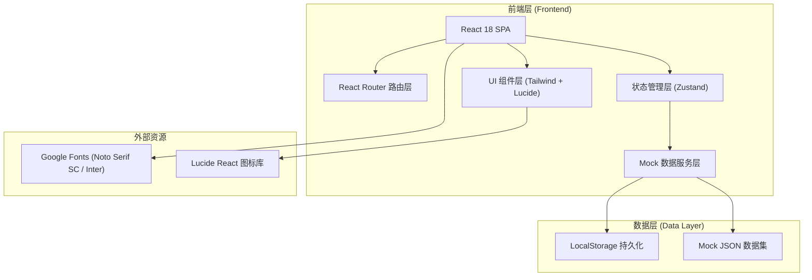
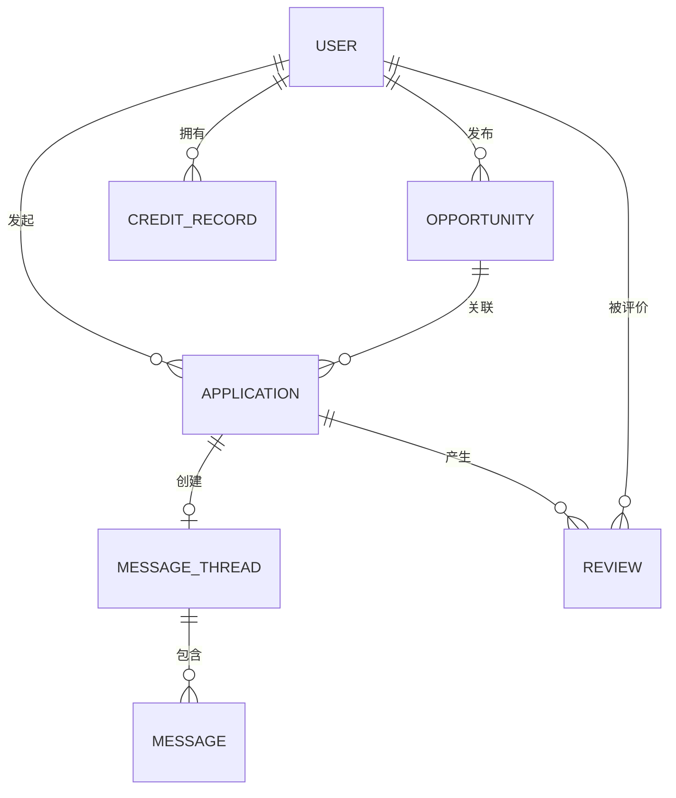

## 1. 架构设计



---

## 2. 技术描述

- **前端框架**：React 18 + TypeScript 5.4（严格模式）
- **构建工具**：Vite 5.2（热更新、Rollup 打包优化）
- **样式方案**：TailwindCSS 3.4 + PostCSS + Autoprefixer（自定义主题变量）
- **路由管理**：React Router v6（BrowserRouter、嵌套路由、懒加载）
- **状态管理**：Zustand 4.5（轻量级 store，避免 Redux 过度设计）
- **UI 图标**：Lucide React（线性风格，300+ 图标）
- **图表可视化**：Recharts 2.12（统计看板、趋势折线、雷达图）
- **工具库**：date-fns（日期处理）、clsx（条件类名拼接）
- **数据来源**：Mock 数据 + LocalStorage 持久化模拟 CRUD
- **代码规范**：ESLint + Prettier + TypeScript 严格模式
- **初始化方式**：`npm create vite@latest referral-swap -- --template react-ts`

---

## 3. 路由定义

| Route 路径 | 页面组件 | 用途说明 |
|------------|----------|----------|
| `/` | HomePage | 首页：待办事项 + 成功推荐统计 + 快捷入口 |
| `/opportunities` | OpportunitiesPage | 机会广场：内推机会搜索、浏览、发布 |
| `/profile` | ProfilePage | 个人主页：资料、认证、发布管理、简历 |
| `/applications` | ApplicationsPage | 交换申请：发起/收到的申请管理、处理 |
| `/messages` | MessagesPage | 消息中心：会话列表、站内沟通对话 |
| `/credits` | CreditsPage | 信用记录：守约评分、评价列表、举报入口 |
| `*` | NotFoundPage | 404 错误页：友好引导回首页 |

---

## 4. 数据类型定义（TypeScript）

```typescript
// 用户类型
interface User {
  id: string;
  name: string;
  avatar: string;
  title: string;
  company: string;
  role: 'seeker' | 'employee';
  bio: string;
  email: string;
  phone?: string;
  city: string;
  verifiedIdentity: boolean;
  verifiedCompany: boolean;
  verifiedEducation: boolean;
  creditScore: number;
  privacyLevel: 'public' | 'verified' | 'private';
  skills: string[];
  createdAt: string;
}

// 内推机会类型
interface Opportunity {
  id: string;
  publisherId: string;
  company: string;
  companyLogo: string;
  position: string;
  city: string;
  industry: string;
  salaryMin: number;
  salaryMax: number;
  salaryUnit: 'K' | 'W';
  experience: string;
  education: string;
  description: string;
  referralNote: string;
  desiredExchange: string[];
  visibility: 'public' | 'verified' | 'network';
  status: 'open' | 'paused' | 'closed';
  matchScore?: number;
  viewCount: number;
  applicationCount: number;
  createdAt: string;
  updatedAt: string;
}

// 交换申请类型
interface Application {
  id: string;
  opportunityId: string;
  applicantId: string;
  publisherId: string;
  resumeSummary: string;
  resumeFile?: string;
  coverLetter: string;
  status: 'pending' | 'accepted' | 'rejected' | 'in_progress' | 'interview' | 'offer' | 'hired' | 'failed';
  progressTimeline: ProgressStep[];
  messageThreadId?: string;
  createdAt: string;
  updatedAt: string;
}

interface ProgressStep {
  status: string;
  time: string;
  note?: string;
}

// 消息类型
interface MessageThread {
  id: string;
  participants: string[];
  lastMessage: string;
  lastMessageTime: string;
  unreadCount: number;
  applicationId?: string;
}

interface Message {
  id: string;
  threadId: string;
  senderId: string;
  content: string;
  type: 'text' | 'file' | 'resume' | 'system';
  fileUrl?: string;
  fileName?: string;
  timestamp: string;
  read: boolean;
}

// 评价类型
interface Review {
  id: string;
  reviewerId: string;
  revieweeId: string;
  applicationId: string;
  rating: number;
  dimensions: {
    responseSpeed: number;
    keepingPromise: number;
    communication: number;
    quality: number;
  };
  content: string;
  createdAt: string;
}

// 信用记录类型
interface CreditRecord {
  id: string;
  userId: string;
  type: 'success' | 'review' | 'report' | 'warning';
  title: string;
  description: string;
  scoreChange: number;
  relatedId?: string;
  createdAt: string;
}

// 待办事项类型
interface TodoItem {
  id: string;
  type: 'application' | 'message' | 'review' | 'resume';
  title: string;
  description: string;
  relatedId: string;
  priority: 'high' | 'medium' | 'low';
  createdAt: string;
}

// 统计数据类型
interface Statistics {
  totalSuccessReferrals: number;
  monthlyGrowth: number;
  activeApplications: number;
  opportunitiesThisMonth: number;
  monthlyTrend: { month: string; count: number }[];
}
```

---

## 5. 项目目录结构

```
referral-swap/
├── public/
│   └── favicon.svg
├── src/
│   ├── assets/
│   │   └── styles/
│   │       └── globals.css         # Tailwind 基础样式 + 自定义样式
│   ├── components/
│   │   ├── layout/
│   │   │   ├── Navbar.tsx          # 顶部导航栏
│   │   │   └── PageContainer.tsx   # 页面容器
│   │   ├── common/
│   │   │   ├── Button.tsx          # 通用按钮
│   │   │   ├── Card.tsx            # 通用卡片
│   │   │   ├── Badge.tsx           # 标签徽标
│   │   │   ├── Avatar.tsx          # 头像组件
│   │   │   ├── Modal.tsx           # 弹窗容器
│   │   │   ├── Drawer.tsx          # 抽屉组件
│   │   │   ├── Tabs.tsx            # 标签页
│   │   │   ├── EmptyState.tsx      # 空状态
│   │   │   └── Skeleton.tsx        # 骨架屏
│   │   ├── home/
│   │   │   ├── StatCard.tsx        # 统计卡片
│   │   │   ├── TodoList.tsx        # 待办列表
│   │   │   └── QuickActions.tsx    # 快捷操作
│   │   ├── opportunities/
│   │   │   ├── SearchBar.tsx       # 搜索筛选栏
│   │   │   ├── OpportunityCard.tsx # 机会卡片
│   │   │   ├── OpportunityList.tsx # 卡片列表
│   │   │   ├── PublishForm.tsx     # 发布表单
│   │   │   └── OpportunityDetail.tsx # 机会详情
│   │   ├── profile/
│   │   │   ├── ProfileCard.tsx     # 资料卡
│   │   │   ├── VerificationBadges.tsx # 认证徽章
│   │   │   └── ResumeEditor.tsx    # 简历编辑
│   │   ├── applications/
│   │   │   ├── ApplicationCard.tsx # 申请卡片
│   │   │   └── ApplicationDetail.tsx # 申请详情
│   │   ├── messages/
│   │   │   ├── ThreadList.tsx      # 会话列表
│   │   │   └── ChatWindow.tsx      # 对话窗口
│   │   └── credits/
│   │       ├── ScoreOverview.tsx   # 评分概览
│   │       ├── RadarChart.tsx      # 雷达图
│   │       └── ReviewList.tsx      # 评价列表
│   ├── pages/
│   │   ├── HomePage.tsx
│   │   ├── OpportunitiesPage.tsx
│   │   ├── ProfilePage.tsx
│   │   ├── ApplicationsPage.tsx
│   │   ├── MessagesPage.tsx
│   │   ├── CreditsPage.tsx
│   │   └── NotFoundPage.tsx
│   ├── store/
│   │   ├── userStore.ts            # 用户状态
│   │   ├── opportunityStore.ts     # 机会状态
│   │   ├── applicationStore.ts     # 申请状态
│   │   ├── messageStore.ts         # 消息状态
│   │   └── creditStore.ts          # 信用状态
│   ├── data/
│   │   ├── mockUsers.ts            # Mock 用户
│   │   ├── mockOpportunities.ts    # Mock 机会
│   │   ├── mockApplications.ts     # Mock 申请
│   │   ├── mockMessages.ts         # Mock 消息
│   │   └── mockReviews.ts          # Mock 评价
│   ├── types/
│   │   └── index.ts                # 类型定义
│   ├── utils/
│   │   ├── format.ts               # 格式化函数
│   │   ├── constants.ts            # 常量配置
│   │   └── helpers.ts              # 辅助函数
│   ├── hooks/
│   │   └── useLocalStorage.ts      # 本地存储 Hook
│   ├── App.tsx                     # 根组件 + 路由
│   ├── main.tsx                    # 入口
│   └── vite-env.d.ts
├── index.html
├── package.json
├── tsconfig.json
├── vite.config.ts
├── tailwind.config.js
├── postcss.config.js
├── .eslintrc.cjs
└── .prettierrc
```

---

## 6. 数据模型（Mock 结构）

### 6.1 ER 关系图



### 6.2 Mock 数据结构说明

- **mockUsers.ts**：10 个示例用户（5 个求职者 + 5 个在职员工），含认证信息、技能标签
- **mockOpportunities.ts**：15 个示例内推机会，覆盖互联网/金融/制造业/教育等行业，分布于北上广深杭
- **mockApplications.ts**：8 个示例申请，覆盖 pending/accepted/in_progress 等状态
- **mockMessages.ts**：5 组对话线程，含文本消息和简历附件消息
- **mockReviews.ts**：12 条评价记录，评分分布在 3-5 星

### 6.3 状态持久化策略

- 初始化时从 LocalStorage 读取，若无数据则使用 Mock 数据初始化
- 所有 Store 的数据变更通过中间件自动同步到 LocalStorage
- 刷新页面后状态恢复，模拟真实后端持久化
